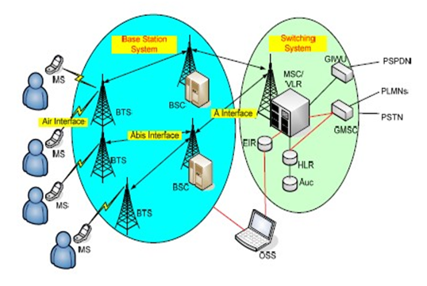
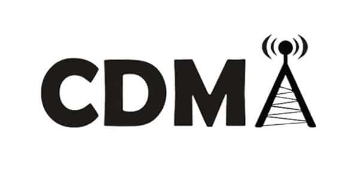
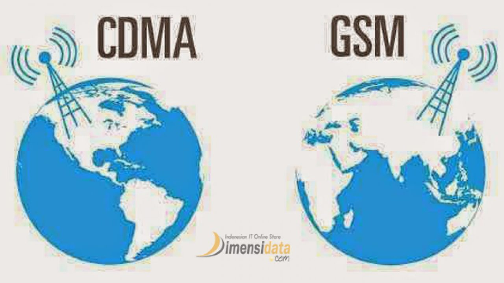
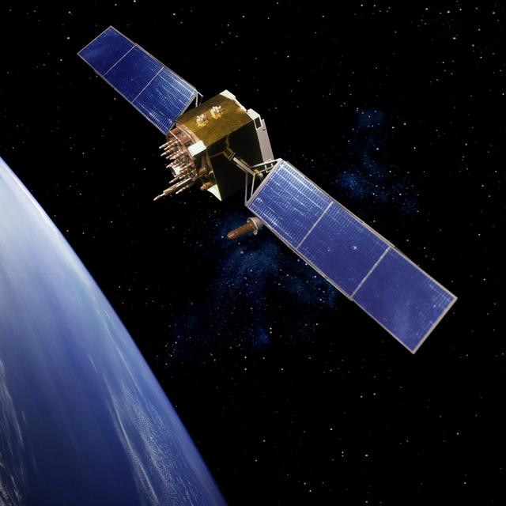
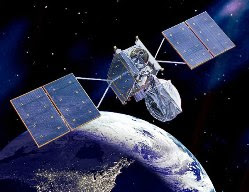

## Jaringan Seluler
jaringan seluler adalah jaringan komunikasi yang tautan terakhirnya adalah nirkabel. Jaringan didistribusikan di atas area daratan yang disebut "sel", masing-masing dilayani oleh setidaknya satu transceiver lokasi tetap, tetapi lebih normal, tiga lokasi sel atau stasiun transceiver dasar.

### Tipe tipe jaringan seluler
1.  1G mengacu pada generasi pertama dari teknologi seluler nirkabel (telekomunikasi seluler). Ini adalah standar telekomunikasi analog yang diperkenalkan pada 1980-an. 1G pada     umumnya adalah teknologi analog dan ponsel yang memiliki daya tahan baterai yang terbatas dan kualitas suara tanpa keamanan yang besar, dan kadang-kadang akan mengalami         panggilan yang terputus (dropped calls). Kecepatan maksimal dari 1G yaitu 2.4 Kbps. Ini adalah standar telekomunikasi analog dan berlanjut hingga digantikan oleh        =       telekomunikasi    digital 2G.
2.  Jaringan 2G muncul pada tahun 1990-an yang menggabungkan sinyal digital ke dalam jaringan seluler. 2G adalah implementasi digital pertama dari komunikasi suara nirkabel. 2G     juga memperkenalkan layanan data seluler yang aman dan mampu mengirimkan pesan teks (SMS) dan pesan multimedia (MMS). 2G juga menerapkan konsep CDMA dan GSM. Dengan konsep       CDMA dan GSM itu kecepatan maksimal dari jaringan 2G bisa mencapai 50 Kbps atau 1 Mbps. Perbedaan utama antara 1G dan 2G yaitu sinyal radio yang digunakan oleh jaringan 1G       dalah analog, sedangkan jaringan 2G adalah digital.
3.  3G Generasi ini menetapkan standar untuk sebagian besar teknologi nirkabel yang telah kita kenal dan gunakan saat ini. Penanganan data broadband menjadi ciri khas sistem 3G     dan merupakan persyaratan bagi ponsel pintar yang memproses aplikasi berat data yang terlibat dngan jejaring sosial, streaming musik dan video, dan sistem GPS. Dalam             generasi yang di perkenalkan secara pada tahun 2001 ini kecepatan maksimal internet bisa mencapai 0.2 Mbps. Bahkan beberapa provider sudah bisa menggunakan kecepatan yang       lebih dari itu dan bisa disebut sebagai jaringan seluler 3.5G atau 3.75G.
4.  Jaringan 4G telah mulai meningkatkan data bandwidth sekitar sepuluh kali lipat dari jaringan 3G. 4G adalah teknologi yang sangat berbeda dibandingkan dengan 3G. 4G               dihadirkan untuk menyediakan jaringan internet dengan kecepatan tinggi, kualitas tinggi dan kapasitas tinggi kepada pengguna namun tetap menjaga tingkat keamanan, menurunkan     biaya layanan suara dan data, multimedia dan internet melalui IP. Standar yang di tawarkan dari jaringan 4G adalah kecepatan akses searching, pelayanan games, video dengan       kualitas tinggi, TV-support dan masih banyak lagi. Kecepatan maksimal jaringan 4G adalah 100 Mbps atau 1 Gbps.
5.  Jaringan 5G merupakan generasi berikutnya yang menawarkan kecepatan yang lebih dan koneksi yang jauh lebih baik daripada generasi sebelumnya baik di smartphone atau pun         perangkat lainnya. Dengan menggabungkan teknologi jaringan mutakhir serta penelitian-penelitian terbaru, 5G mampu menawarkan koneksi yang jauh lebih cepat daripada koneksi       yang ada saat ini. Kecepatan maksimal yang diperkirakan  mencapai 35.46 Gbps yang berarti 35 kali lebih cepat daripada 4G.
  
## GSM (Global System for Mobile Communication)
Global System for Mobile Communication (GSM) merupakan sebuah teknologi komunikasi selular yang bersifat digital. Teknologi GSM banyak diterapkan pada mobile communication, khususnya handphone. Teknologi inimemanfaatkan gelombang mikro dan pengiriman sinyal yang dibagi berdasarkan waktu, sehingga sinyal informasi yang dikirim akan sampai pada tujuan. GSM dijadikan standar global untuk komunikasi selular sekaligus sebagai teknologi selular yang paling banyak digunakan orang di seluruh dunia. Di Eropa, awalnya GSM di desain beroperasi pada frekuensi 900 Mhz.

Dengan frekuensi uplinks-nya menggunakan frekuensi 890–915 MHz, sedangkan frekuensi downlinksnya menggunakan frekuensi 935–960 MHz. Bandwith yang digunakan adalah 25 Mhz (915–80 = 960–35 = 25 Mhz) dan lebar kanal sebesar 200 Khz. Dari keduanya, maka didapatkan 125 kanal, dimana 124 kanal digunakan untuk suara dan satu kanal untuk sinyal. Pada perkembangannya, jumlah kanal 124 tidak mencukupi untuk memenuhi kebutuhan dikarenakan pesatnya pertumbuhan jumlah pengguna. Untuk memenuhi kebutuhan kanal yang lebih banyak, maka regulator GSM di Eropa menggunakan tambahan frekuensi untuk GSM pada band frekuensi di range 1800 Mhz dengan frekuensi 1710-1785 Mhz sebagai frekuensi uplinks dan frekuensi 1805-1880 Mhz sebagai frekuensi downlinks. GSM dengan frekuensinya yang baru ini kemudian dikenal dengan sebutan GSM 1800, dimana tersedia bandwidth sebesar 75 Mhz (1880-1805 = 1785–1710 = 75 Mhz). Dengan lebar kanal yang tetap sama yaitu 200 Khz sama, pada saat GSM pada frekuensi 900 Mhz, maka pada GSM 1800 ini akan tersedia sebanyak 375 kanal. Di Eropa, standar-standar GSM kemudian juga digunakan untuk komunikasi railway, yang kemudian dikenal dengan nama GSM-R.

### Sejarah GSM
Jaringan GSM diciptakan pada tahun 1982 dari pertemuan antara para ahli komunikasi tingkat tinggi pada Konferensi European Conference of Postal and Telecommunications Administrations. Awalnya pertemuan ini memiliki tujuan untuk mengatasi infrastruktur seluler di Eropa, tapi kemudian meluas ke negara lainnya dengan cepat. Banyak standar dan prosedur operasional jaringan GSM diterbitkan dalam jurnal tahunan. Pakar industri tersebut membantu merampingkan protokol komunikasi dari satu sistem ke sistem lainnya.
Arsitektur jaringan
Secara umum, network element dalam arsitektur jaringan GSM dapat dibagi menjadi:
1.	Mobile Station (MS)
2.	Base Station Sub-system (BSS)
3.	Network Sub-system (NSS),
4.	Operation and Support System (OSS)
Secara bersama-sama, keseluruhan network element di atas akan membentuk sebuah PLMN (Public Land Mobile Network).
Mobile Station (MS) merupakan perangkat yang digunakan oleh pelanggan untuk melakukan pembicaraan. Terdiri atas:
1.  Mobile Equipment (ME) atau handset, merupakan perangkat GSM yang berada di sisi pengguna atau pelanggan yang berfungsi sebagai terminal transceiver (pengirim dan penerima sinyal) untuk berkomunikasi dengan perangkat GSM lainnya.
2.  Subscriber Identity Module (SIM) atau SIM Card, merupakan kartu yang berisi seluruh informasi pelanggan dan beberapa informasi pelayanan. ME tidak akan dapat digunakan tanpa SIM didalamnya, kecuali untuk panggilan darurat. Data yang disimpan dalam SIM secara umum, adalah:
1.	IMMSI (International Mobile Subscriber Identity), merupakan penomoran pelanggan.
2.	MSISDN (Mobile Subscriber ISDN), nomor yang merupakan nomor panggil pelanggan.
Base Station System (BSS), terdiri atas:
1.  BTS Base Transceiver Station, perangkat GSM yang berhubungan langsung dengan MS dan berfungsi sebagai pengirim sinyal.
2.  BSC Base Station Controller, perangkat yang mengontrol kerja BTS-BTS yang berada di bawahnya dan sebagai penghubung BTS dan MSC
Network Sub System (NSS), terdiri atas:
1.  Mobile Switching Center atau MSC, merupakan sebuah network element central dalam sebuah jaringan GSM. MSC sebagai inti dari jaringan seluler, di mana MSC berperan untuk interkoneksi hubungan pembicaraan, baik antar seluler maupun dengan jaringan kabel PSTN, ataupun dengan jaringan data.
2.  Home Location Register atau HLR, yang berfungsi sebagai sebuah database untuk menyimpan semua data dan informasi mengenai pelanggan agar tersimpan secara permanen.
3.  Visitor Location Register atau VLR, yang berfungsi untuk menyimpan data dan informasi pelanggan.
4.  Authentication Center atau AuC, yang diperlukan untuk menyimpan semua data yang dibutuhkan untuk memeriksa keabsahaan pelanggan. Sehingga pembicaraan pelanggan yang tidak sah dapat dihindarkan.
5.  Equipment Identity Registration atau EIR, yang memuat data-data pelanggan.
Operation and Support System (OSS), merupakan sub sistem jaringan GSM yang berfungsi sebagai pusat pengendalian, diantaranya fault management, configuration management, performance management, dan inventory management.
Frekuensi pada 3 Operator Terbesar di Indonesia
1.	Indosat: 890 – 900 Mhz (10 Mhz)
2.	Telkomsel: 900 – 907,5 Mhz (7,5 Mhz)
3.	Excelcomindo: 907,5 – 915 Mhz (7,5 Mhz)

## CDMA (Code Division Multiple Access)
teknologi CDMA pertama kali digunakan pada saat meletusnya Perang Dunia II. Teknologi ini digunakan untuk menyulitkan tentara Jerman dalam menangkap sinyal yang jelas dan lengkap. Dalam perkembangannya, CDMA digunakan dalam banyak sistem komunikasi termasuk pada Global Positioning System (GPS) dan pada sistem satelit OmniTRACS untuk logistik transportasi. CDMA sendiri adalah metode pengaksesan chanel dengan menggunakan banyak frekuensi radio telekomunikasi dan juga merupakan protokol data wireless. CDMA beroperasi pada frekuensi 800 sampai 1900 MHz.

### Sejarah CDMA
Teknologi CDMA pada awalnya dipergunakan dalam komunikasi radio militer Amerika Serikat (AS), mulai tahun 1990 patennya diberikan kepada Qualcomm, Inc. dan dijadikan sebagai standar seluler digital di AS sejak tahun 1993. Oleh karena itu tidak heran jika teknologi ini sangat aman karena tidak dapat digandakan (dikloning). Sehingga teknologi ini sangat cocok bagi kegunaan layanan telepon banking, seperti transfer, cek saldo, dll.
Mengenal CDMA
CDMA (code division multiple access) adalah teknologi akses jamak dimana masing-masing user menggunakan code yang unik dalam mengakses kanal yang terdapat dalam sistem. Pada CDMA, sinyal informasi pada transmitter decoding dan disebar dengan bandwidth sebesar 1.25 MHz (spread spectrum), kemudian pada sisi repeater dilakukan decoding sehingga didapatkan sinyal informasi yang dibutuhkan. CDMA (Code Division Multiple Access) merupakan metoda multiplexing yang paling canggih dan rumit. Seluruh daerah frekuensi digunakan bersama-sama tanpa pembagian kanal. Untuk membedakan antara masing-masing hubungan digunakan sistem pengkodean dengan modulasi frekuensi (pengubahan pola frekuensi pembawa) secara unik untuk masing-masing hubungan. Code Division Multiple Access (CDMA) adalah teknologi berbasis spread spectrum yang mengijinkan banyak user menempati kanal radio yang sama, diterapkan pada system IS-95, J-STD-008, dsb. Sistem komunikasi CDMA ini mempunya spesifikasi sebagai  berikut :
•	Bandwidth : 1.25 MHz
•	Frek Uplink : 869 – 894 MHz atau 1930 – 1990 MHz
•	Free Downlink : 824 – 894 MHz atau 1850 – 1910 MHz

### Sifat-Sifat CDMA
•	Kapasitas lebih tinggi
•	Peningkatan call security
•	Mereduksi derau dan interfensi lainnya
•	Efisiensi daya
•	Fasilitas koordinasi seluruh frekuensi
•	Integrasi layanan suara,data dan video

## Perbedaan GSM dan CDMA

1.  Pertama, adalah perbedaan dalam luas cakupan BTS (Base Transceiver Station) antara GSM dengan CDMA. Dimana teknologi GSM itu lebih dominan daripada milik CDMA.  Yup BTS-BTS milik GSM bertebaran hampir diseluruh wilayah bila dibandingkan dengan BTS milik CDMA. Yang menjadikan popularitas GSM melebihi popularitas CDMA.

2.  Kedua, GSM juga lebih unggul dalam hal roaming. Apa itu Roaming? Anggap saja kamu berada di Bandung dan menelepon sahabat di kota Aceh dan itulah dimana saat kita menggunakan layanan roaming. GSM lebih unggul karena mempunyai kemampuan yang lebih dalam hal roaming, dimana GSM bisa digunakan untuk menghubungi pengguna lainnya dikota-kota lain. Sedangkan CDMA sendiri tidak memilikinya, tapi jika mau membayar lebih, penggunaan roaming bisa dilakukan.

3.  Ketiga, dengan melihat hal pertama dan kedua, kamu bisa menarik kesimpulan bahwa orang sudah pasti akan memilih GSM untuk jaringan selularnya. Dan itu terbukti dari jumlah pemakainya. Dimana pemakai GSM bisa 5-6 kali lipat dari pengguna CDMA pada saat ini.

4.  Keempat, dalam segi keamanan ternyata teknologi CDMA lebih unggul daripada GSM. Ini 
dikarenakan teknologi CDMA lebih menggunakan kode-kode unik dalam tiap transfer datanya. Sedangkan GSM hanya mengandalkan timeslot. Dan membuat keamanan CDMA lebih sulit untuk dibobol bila mau dibandingkan dengan GSM.

5.  Kelima, adalah perbandingan biaya investasi. Dimana teknolgi CDMA tidak membutuhkan perangkat-perangkat serumit seperti implementasi pada GSM. Artinya jika melihat dari segi finansial, teknologi CDMA akan jauh lebih murah daripada GSM. Buktinya? Biaya percakapan kita melalui CDMA sudah pasti jauh lebih murah bila dibanding dengan percakapan melalui GSM.

6.  Keenam, dengan melihat hal diatas, maka harga untuk iperangkatnya pun lebih sangat jauh berbeda antara GSM dengan CDMA. Perangkat GSM harganya akan jauh lebih tinggi 2-3 kali lipat daripada CDMA. Tentunya ini sangat berkaitan dengan biaya investasi antara ke-2 teknologi tersebut.

## SATELIT
Kata satelit berasal dari kata latin satelles yang diartikan pelayan, atau seseorang yang mematuhi atau melayani pihak lain. Sedangkan secara ilmiah, satelit adalah suatu benda yan bergerak mengitari benda lain—biasanya lebih besar— dalam jalur yang dapat diprediksi yang disebut orbit, atau singkatnya setiap benda angkasa yang bergerak mengitari sebuah planet membentuk jalur lingkaran atau eliptikal.

Satelit sendiri secara sederhana dibagi menjadi 2 jenis yaitu:
1.  Satelit Alami. Satelit yang memang berasal dari alam, contoh sederhananya adalah bulan yang menjadi satelit alami bagi bumi. Bumi dan planet-planet lain dalam tata surya kita juga menjadi satelit alami dari matahari.
2.  Satelit Buatan. Satelit yang dibuat oleh manusia ditempatkan disuatu orbit menggunakan kendaraan peluncur untuk fungsi tertentu, untuk komunikasi, pemetaan, monitor cuaca dan lain sebagainya. Contohnya seperti satelit Palapa, Telkom, Garuda, Indostar dan banyak lainnya.

### Fungsi Satelit bagi Kehidupan di Bumi
1.  Bulan : Bulan sebagai satu-satunya satelit alami bagi bumi memiliki peran yang sangat penting. Satelit ini tidak memiliki cahaya sendiri dan hanya memantulkan cahaya sinar matahari.Berkat pantulan ini, manusia dapat memanfaatkannya untuk menghitung kalender berdasarkan bentuk yang terlihat dari bumi.Selain itu, bulan juga berperan dalam pasang surutnya air laut yang secara langsung bisa dimanfaatkan oleh para nelayan untuk berlayar.Bulan juga dapat melindungi bumi dari jatuhnya meteor secara langsung. Hal itu dikarenakan gaya gravitasi bulan yang memungkinkan benda asing tidak langsung jatuh ke bumi.
2.  Satelit Astronomi : Satelit ini berfungsi untuk mengamati planet, bintang dan berbagai fenomena lain di luar angkasa. Salah satu satelit yang memiliki fungsi ini adalah satelit Hubble yang juga digunakan untuk mengambil gambar Red Rose Nebula.
3.  Satelit Komunikasi : Satelit ini berfungsi sebagai pendukung sistem komunikasi jarak jauh, seperti telepon, pengiriman data dan juga internet.Dengan adanya satelit ini aktifitas telekomunikasi jarak jauh dapat berjalan secara lancar dan berkembang hingga sejauh ini.Salah satu provider internet milik Indonesia bahkan memiliki satelit sendiri yang sudah diluncurkan.
4.  Satelit Cuaca : satelit ini bertugas sebagai pemantau kondisi cuaca yang ada di bumi.Bahkan penggunaan lebih jauh bisa dimanfaatkan untuk memprediksi kondisi cuaca hingga beberapa hari ke depan.
5.  Satelit Navigasi (GPS) : Sistem satelit ini digunakan sebagai navigasi atau pabrikasi peta. Penggunaan paling umum adalah saat mengaktifkan GPS untuk mengetahui lokasi kita secara akurat di dalam peta.Aplikasi ojek online yang sering menjadi langganan kita saat ingin bepergian juga memanfaatkan satelit jenis ini untuk dapat beroperasi.
6.  Satelit Militer : Satelit ini digunakan untuk berbagai kepentingan militer suatu negara. Biasanya bersifat sangat rahasia dan memiliki keamanan data yang tinggi.
7.  Satelit Penelitian Ilmiah : Satelit ini digunakan sebagai penyedia informasi yang menunjang berbagai penelitian ilmiah seperti informasi meteorologi, survei terhadap kondisi tanah, radio amatir dan berbagai penelitian lainnya yang memerlukan penginderaan jarak jauh di luar angkasa.
8.  Satelit Kecil : Satelit ini memiliki bentuk paling kecil dibanding jenis satelit lainnya. Untuk satelit mini memiliki berat antara 500 hingga 2000 kg, satelit mikro antara 10 hingga 200 kg dan satelit nano memiliki bobot kurang dari 10 kg saja.

### Karakteristik Satelit
1.  Cara kerja satelit secara system konvensional : Yaitu dengan mengirimkan sinyal dari computer dan direlai oleh satelit tanpa di lakukan pemprosesan dalam satelit. Kelemahan metode ini, computer yang ter-hubung langsung pada satelit harus bekerja selama 24 jam. Jika salah satu computer dimatikan maka hubungan ke computer tersebut akan terputus. Keuntungannya satelit komunikasi konvensional dapat digunakan tanpa perlu dimodifikasi. Computer dalam satelit berfungsi untuk menyimpan sementara informasi yang secara otomatis dapat dilakukan.
2.  Cara kerja transmisi data melalui satelit : Pemanfaatan system komunikasi satelit telah memberikan kemampuan bagi manusia untuk berkomunikasi dan mendapatkan informasi dari berbagai penjuru dunia secara simultan tanpa memperhatikan jarak relatifnya.

### Sejarah Satelit
Satelit buatan manusia pertama adalah Sputnik 1, diluncurkan oleh Soviet pada tanggal 4 Oktober 1957, dan memulai Program Sputnik Rusia, dengan Sergei Korolev sebagai kepala disein dan Kerim Kerimov sebagai asistentnya. Peluncuran ini memicu lomba ruang angkasa (space race) antara Soviet dan Amerika. Sputnik 1 membantu mengidentifikasi kepadatan lapisan atas atmosfer dengan jalan mengukur  perubahan orbitnya dan memberikan data dari distribusi signal radio pada lapisan ionosphere.
Karena badan satelit ini diisi dengan nitrogen bertekanan tinggi, Sputnik 1 juga memberi kesempatan pertama dalam pendeteksian meteorit, karena hilangnya tekanan dalam disebabkan oleh penetrasi meteroid bisa dilihat melalui data suhu yang dikirimkannya ke bumi. Sputnik 2 diluncurkan pada tanggal 3 November 1957 dan membawa awak mahluk hidup pertama ke dalam orbit, seekor anjing bernama Laika. Pada bulan Mei, 1946, Project Rand mengeluarkan desain preliminari untuk experimen wahana angkasa untuk mengedarai dunia, yang menyatakan bahwa, “sebuah kendaraan satelit yang berisi instrumentasi yang tepat bisa diharapkan menjadi alat ilmu yang canggih untuk abad ke dua puluh”.
Amerika sudah memikirkan untuk meluncurkan satelit pengorbit sejak 1946 dibawah Kantor Aeronotis angkatan Laut Amerika (Bureau of Aeronautics of the United States Navy). Project RAND milik Angkatan Udara Amerika akhirnya mengeluarkan laporan diatas, tetapi tidak mengutarakan bahwa satelit memiliki potensi sebagai senjata militer. Tetapi, mereka menganggapnya sebagai alat ilmu, politik, dan propaganda. Pada tahun 1954, Sekertariat Pertahanan Amerika menyatakan, “Saya tidak mengetahui adanya satupun program satelit Amerika.” Pada tanggal 29 Juli 1955, Gedung Putih mencanangkan bahwa Amerika Serikat akan meluncurkan satelit pada musim semi 1958. Hal ini kemudian diketahui sebagai Project Vanguard. Pada tanggal 31 Juli, Soviets mengumumkan bahwa mereka akan meluncurkan satelit pada musim gugur 1957. mengorbit bumi adalah Station Angkasa Interasional (International Space Station).

## GPS (Global Positioning System)
GPS adalah nama yang umumnya. Akan tetapi, GPS atau Global Positioning System sebenarnya adalah sistem yang memungkinkan kita menentukan lokasi secara akurat menggunakan satelit, yang diciptakan oleh Amerika Serikat. Rusia (GLONASS) dan China (BeiDou) pun memiliki solusi penentu lokasi yang serupa.Untuk dapat mengetahui lokasinya dengan
menggunakan satelit (GPS/GLONASS/BeiDou), smartphone sebenarnya tidak membutuhkan paket data. Mengapa demikian? Karena, yang dilakukan oleh sistem navigasi di dalam smartphone Anda adalah “mendengar” sinyal dari satelit, bukan melakukan transaksi data.
### Fungsi GPS
untuk menentukan letak di permukaan bumi dengan bantuan sinkronisasi sinyal satelit yang mengirimkan sinyal gelombang mikro ke Bumi , sehingga dapat digunakan untuk menentukan kecepatan, arah, letak, dan waktu.

### Jenis GPS dan Kegunaannya
1.  GPS untuk Militer : GPS dapat dimanfaatkan untuk mendukung sistem pertahanan militer. Lebih jauh dari itu bisa memantau pergerakan musuh saat terjadi peperangan, juga bisa menjadi penuntun arah jatuhnya bom sehingga bisa lebih tertarget.
2.  GPS untuk Navigasi : Dalam kebutuhan berkendara sistem GPS pun sangat membantu, dengan adanya GPS Tracker terpasang pada kendaraan maka akan membuat perjalanan semakin nyaman karena arah dan tujuan jalan bisa diketahui setelah GPS mengirim posisi kendaraan kita yang diterjemahkan ke dalam bentuk peta digital.
3.  GPS untuk Sistem Informasi Geografis : untuk sistem informasi geografis perlu digunakannya GPS agar dapat dipermudah, seperti untuk pembuatan peta, mengukur jarak perbatasan, atau bisa dijadikan sebagai referensi pengukuran suatu wilayah.
4.  GPS untuk Sistem Pelacakan Kendaraan : Digunakan untuk kebutuhan sistem pelacakan yaitu alat penampil dan penerima sinyal yang berbeda lokasi. Contohnya kita bisa mengetahui lokasi kendaraan yang hilang dengan melihat titik kordinat yang dihasilkan dari alat yang terpasang dalam kendaraan tersebut, untuk melihatnya bisa melalui media smartphone atau alat-alat khusus lainnya.
5.  GPS untuk Pemantau Gempa : Saat ini teknologi GPS yang terus ditingkatkan menghasilkan tingkat ketelitian dan keakuratan yang sangat tinggi sehingga GPS dapat dimanfaatkan untuk memantau pergerakan tanah di bumi. Dengan hal itu maka para ahli Geologi dapat memperkirakan kemungkinan terjadinya gempa di suatu wilayah.

### Kemampuan GPS
1.  GPS dapat memberikan informasi tentang posisi, kecepatan, dan waktu secara cepat, akurat, murah, dimana saja di bumi ini pada setiap saat tanpa tergantung cuaca.
2.  GPS adalah satu-satunya sistem navigasi ataupun sistem penentuan posisi, selama beberapa abad ini,yang mempunyai karakteristik Prima sepeti tersebut.

### Sejarah GPS
Global Positioning System (GPS) adalah suatu sistem navigasi yang memanfaatkan satelit. Penerima GPS memperoleh sinyal dari beberapa satelit yang mengorbit bumi. Satelit yang mengitari bumi pada orbit pendek ini terdiri dari 24 susunan satelit, dengan 21 satelit aktif dan 3 buah satelit sebagai cadangan. Dengan susunan orbit tertentu, maka satelit GPS bisa diterima di seluruh permukaan bumi dengan penampakan antara 4 sampai 8 buah satelit. GPS dapat memberikan informasi posisi dan waktu dengan ketelitian sangat tinggi.
Nama lengkap GPS adalah NAVSTAR GPS (Navigational satellite Timing and Ranging Global Positioning System), namun lebih sering dikenal sebagai GPS. GPS mulai diaktifkan untuk umum pada 17 Juli 1995.
      Amerika Serikat merupakan negara pencetus dan pemrakarsa GPS. Pada dasarnya, bentuk sistem teknologi GPS sama dengan sistem navigasi radio pangkalan pusat, seperti LORAN dan Decca Navigator yang dikembangkan pada tahun 1940-an dan digunakan selama Perang Dunia II. Inspirasi pembuatan sistem GPS sebenarnya datang dari Uni Soviet yang pada saat itu, tahun 1957, meluncurkan satelit pertama mereka, Sputnik.
       Sebuah tim ilmuwan AS yang dipimpin oleh Dr. Richard B. Kershner saat itu memonitor transmisi radio Sputnik. Mereka menemukan bahwa Efek Doppler berpengaruh pada transmisi radio, di mana sinyal frekuensi yang ditransmisi Sputnik sangat tinggi saat baru diluncurkan dan semakin rendah seiring dengan satelit menjauhi bumi. Mereka menyadari bahwa dengan mengetahui letak bujur lokasi mereka dengan tepat di peta dunia, mereka mampu melacak posisi satelit tersebut mengorbit berdasarkan tolak ukur penyimpangan Efek Doppler.
Transit, satelit sistem navigasi pertama yang digunakan oleh Angkatan Laut AS sukses diujicobakan pertama kali pada tahun 1960. Sistem yang menggunakan kumpulan dari lima satelit ini mampu menentukan posisi sekali tiap jamnya. Pada 1967, AL AS mengembangkan satelit Timation yang membuktikan kemampuannya dengan menetapkan waktu yang akurat di angkasa, merupakan teknologi acuan sistem GPS. Tahun 1970-an, Sistem Navigasi Omega pangkalan pusat, berdasarkan pembandingan fase sinyal, menjadi sistem navigasi radio pertama yang meliputi seluruh dunia.
       Satelit percobaan pertama Block-I GPS diluncurkan pada Februari 1978. Satelit-satelit GPS pertama kali dibuat oleh Rockwell International (sekarang merupakan bagian dari Boeing) dan sekarang dibuat oleh Lockheed Martin (IIR/IIR-M) dan Boeing (IIF).Arah dan posisi suatu wilayah memiliki peran yang sangat penting dalam berbagai aktivitas. Dan seringkali proses atau cara yang digunakan untuk mendapatkannya tidak praktis. Kehadiran teknologi GPS telah menjawab tantangan yang ada untuk memenuhi kebutuhan tersebut. Dengan teknologi ini manusia dapat mengetahui posisi secara real time dan juga arah jalan yang dituju.Sayangnya, sebagian besar masyarakat Indonesia masih awam dengan gadget canggih yang satu ini. Hal ini mungkin dikarenakan penggunaan GPS hanya bagi mereka yang berkendaraan. Namun, tak dapat dipungkiri, faktor penghambat lain yang utama adalah GPS masih merupakan barang mahal bagi masyarakat kita.Kebutuhan manusia akan arah dan letak memang merupakan barang langka yang baru bisa dipenuhi satu dekade terakhir ini. Penemuan dan pengembangan teknologi GPS merupakan terobosan suskes manusia yang semakin merealisasikan ungkapan “dunia dalam genggaman manusia”. Bagaimana tidak jika teknologi GPS yang dengan bantuan “kroni-kroni” satelitnya mampu merekam bumi dari berbagai sudut ini bahkan sudah dimasukkan ke dalam teknologi telpon genggam yang sudah marak beredar di pasaran saat ini.

## WIMAX
WiMAX adalah singkatan dari Worldwide Interoperability for Microwave Access, merupakan teknologi akses nirkabel pita lebar (broadband wireless access atau disingkat BWA) yang memiliki kecepatan akses yang tinggi dengan jangkauan yang luas.Pada jaringan selular juga telah dikembangkan teknologi yang dapat Pada jaringan selular juga telah dikembangkan teknologi yang dapat Mngalirkan data yang cepat dengan jaringan suara seperti GPRS,EDGE, WCDMA, dan HSDPA.

### Perbedaan Standar Wifi dan Wimax
WiMAX merupakan penggabungan antara 2 standard:
1.  IEEE 802.16 (Institute of Electrical and Electronics  Engineering),Digunakan secara luas di negeri asalnya : Amerika.
2.  ETSI HiperMAN (European Telecommunicatons Standards Institute HiperMAN), Digunakan secara luas di Eropa dan sekitarnya.

### Prinsip Dasar WiMAX
1.  WiIMAX menggunakan akses wireless broadband hingga 50 km untuk stasiun tetap,dan 5-15 km untuk stasiun bergerak.
2.  Sebagai perbandingan WLAN (WiFi) standart 802.11 hanya menjangkau sekitar 30-100 meter.
3.  Mudahnya, cara kerja WiMAX mirip dengan WiFi. Tetapi WiMAX mempunyai  kecepatan yang lebih tinggi, jangkauan yang lebih luas, dan pengguna yg lebih banyak. WiMAX ini juga berpotensi untuk mengatasi masalah akses internet di desa-desa, yang belum punya akses internet karena tidak terjangkau kabel telepon.
